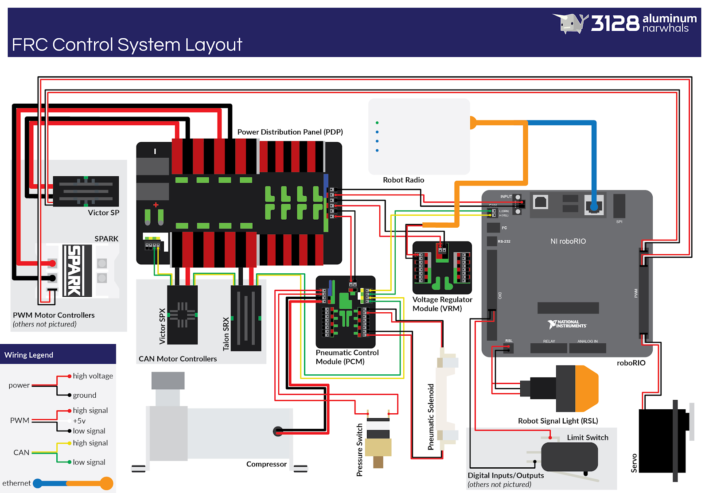

Electrical and Pneumatic Components
=================================== 
An overview of electrical and pnematic components. Broken up in two parts: 

* :ref:`electrical`
* :ref:`pneumatics`

.. _electrical:

Electrical 
~~~~~~~~~~

Electrical Diagram
^^^^^^^^^^^^^^^^^^

Wire Strippers
^^^^^^^^^^^^^^
A wire stripper is a small, hand-held device used to strip the electrical insulation from electric wires.

It helps to cut off the plastic insulator around the wires so we are able to solder them and etc.

.. image:: images/EPComponents/wirestripper.png
Wire Cutters
^^^^^^^^^^^^

Soldering Iron
^^^^^^^^^^^^^^

Shrink Tube/Heat Gun
^^^^^^^^^^^^^^^^^^^^

Wago Tool
^^^^^^^^^

Anderson Connectors
^^^^^^^^^^^^^^^^^^^

Ferrule Connectors
^^^^^^^^^^^^^^^^^^

Power Wire (Black + Red)
^^^^^^^^^^^^^^^^^^^^^^^^

CAN Wire (Green + Yellow)
^^^^^^^^^^^^^^^^^^^^^^^^^

RoboRio 
^^^^^^^

Motors
^^^^^^

Motor Controllers
^^^^^^^^^^^^^^^^^

Limit Switch
^^^^^^^^^^^^

Batteries
^^^^^^^^^

RSL Signal Light 
^^^^^^^^^^^^^^^^

Power Distribution Panel (PDP)
^^^^^^^^^^^^^^^^^^^^^^^^^^^^^^

Fuses
^^^^^

Voltage Regulator Module (VRM)
^^^^^^^^^^^^^^^^^^^^^^^^^^^^^^

Circuit Breaker
^^^^^^^^^^^^^^^

Radio
^^^^^

Extra Stuff (LEDs, Circuits, etc.)
^^^^^^^^^^^^^^^^^^^^^^^^^^^^^^^^^^

.. _pneumatics:

Pneumatics 
~~~~~~~~~~

Pneumatics Diagram
^^^^^^^^^^^^^^^^^^

Pneumatics Control Module (PCM)
^^^^^^^^^^^^^^^^^^^^^^^^^^^^^^^

Pistons
^^^^^^^

Solenoids
^^^^^^^^^

Tubing
^^^^^^

Compressor
^^^^^^^^^^

Air Tank
^^^^^^^^

Pressure Gauge
^^^^^^^^^^^^^^

Pressure Switch
^^^^^^^^^^^^^^^

Pressure Relief Valve
^^^^^^^^^^^^^^^^^^^^^

Brass Connectors
^^^^^^^^^^^^^^^^

T Brass Connectors
^^^^^^^^^^^^^^^^^^

Schematics (Natalie's)
^^^^^^^^^^^^^^^^^^^^^^

Schematics (Raul's)
^^^^^^^^^^^^^^^^^^^

Inspector's Checklist
^^^^^^^^^^^^^^^^^^^^^

