Electrical and Pneumatic Components
=================================== 
An overview of electrical and pnematic components. None of these will appear in the dedicated glossary given that this in itself is much like an 
electrical glossary.Broken up in two parts: 

* :ref:`electrical`
* :ref:`pneumatics`

.. _electrical:

Electrical 
~~~~~~~~~~

Electrical Diagram
^^^^^^^^^^^^^^^^^^

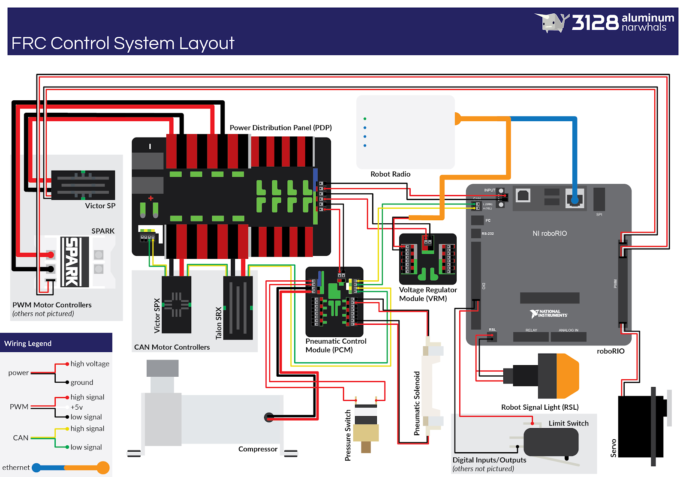

Wire Strippers
^^^^^^^^^^^^^^
* A wire stripper is a small, hand-held device used to strip the electrical insulation from electric wires.
* It helps to cut off the plastic insulator around the wires so we are able to solder them and etc.

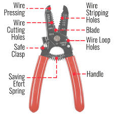
Wire Cutters
^^^^^^^^^^^^
* We use these to cut wires! (Big Surprise!)
* These also work great for cutting zip ties, you don't want to use scissors to cut them

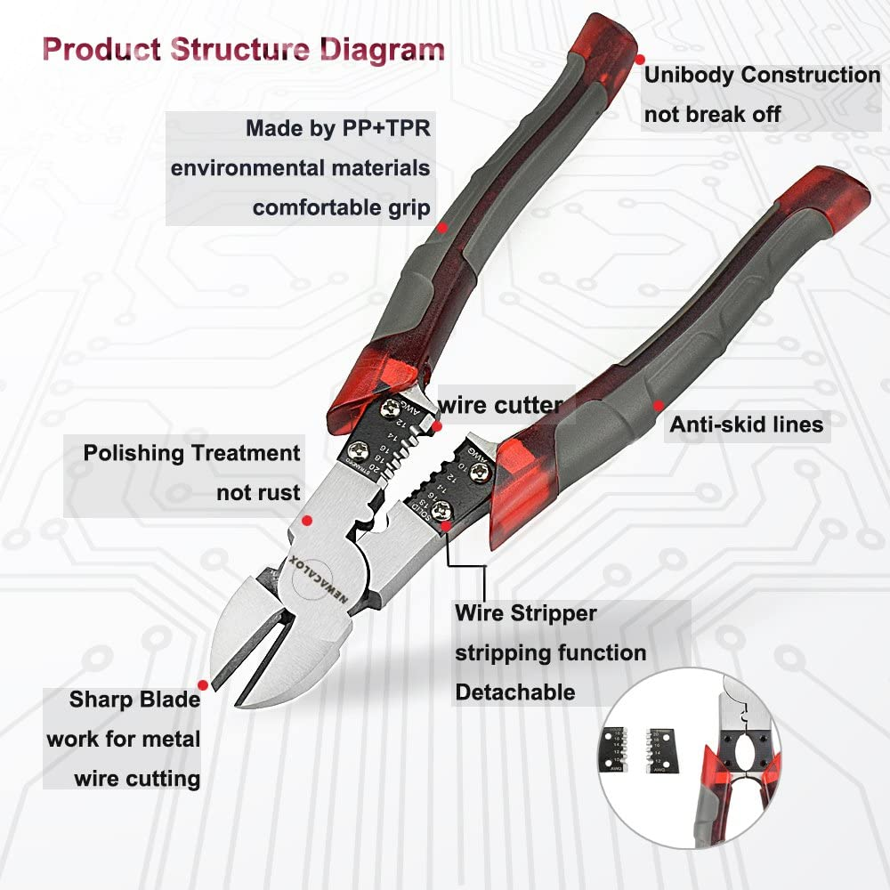
Soldering Iron
^^^^^^^^^^^^^^
* Soldering is a way to connect two wires
* Solder melts and connects the two wires making a solid connection
* Wire sponges made of brass are used to clean the tip of the soldering iron
  
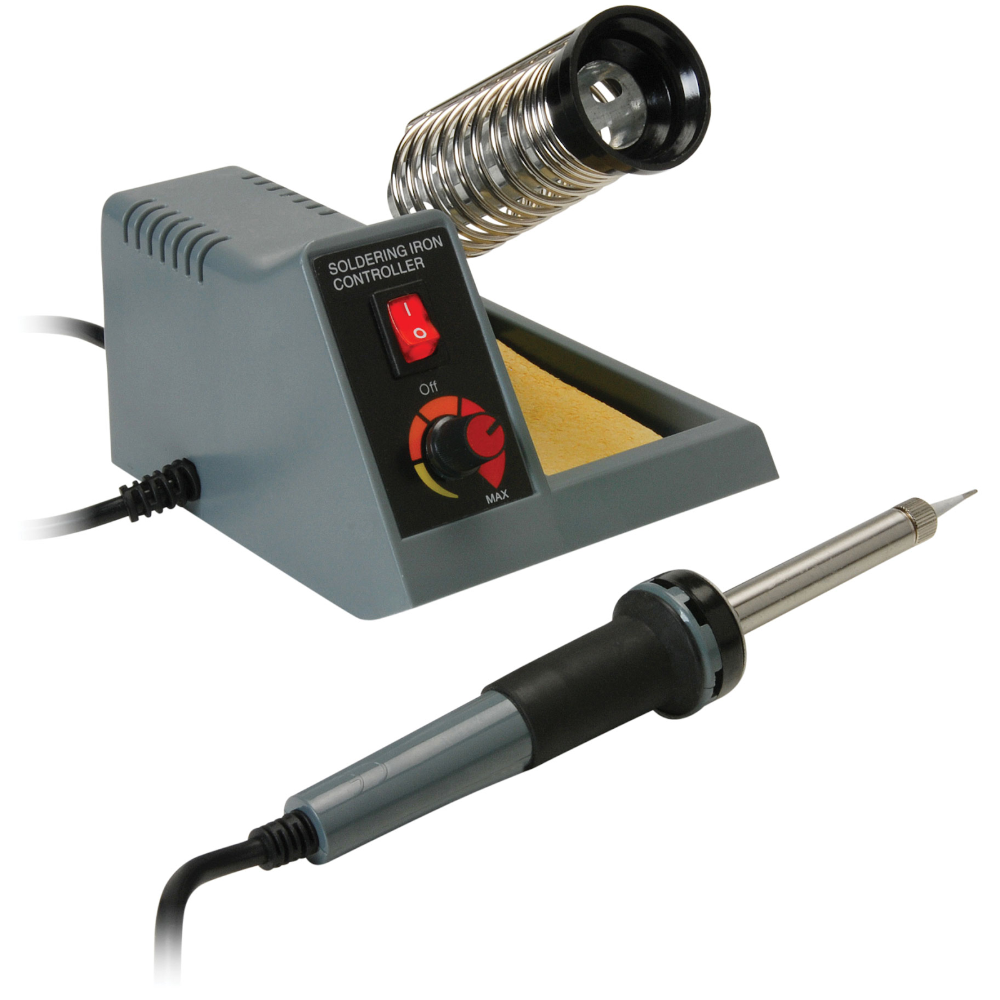
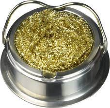
Shrink Tube/Heat Gun
^^^^^^^^^^^^^^^^^^^^
* We use shrink tube to put over soldered wire bare connector to protect it against shocks and shorts
* The heat gun heats up the shrink tube and it shrinks around the wire, securing the connection

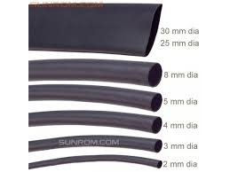
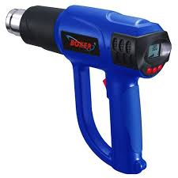
Wago Tool
^^^^^^^^^
* It opens the doorways on the PDP and allows the wire to enter
* It presses down the entrance place for wires of the VRM, PDP, RoboRio, and main components
* Also is very handy to use as a screwdriver on the RoboRio and other components

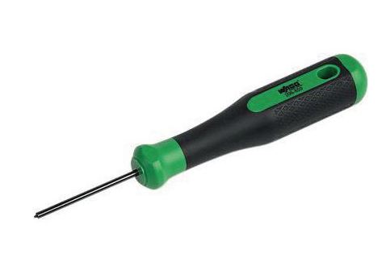
Anderson Connectors
^^^^^^^^^^^^^^^^^^^
* We use these as the main connection points, think soldering, but much better
* These connect to the motors, the PDP, etc. 
* Used for larger gauge wires
* Has a specific tool to attach connector, the outer shells are the plastic black and red pieces, the actual connector is metal (see bottom right)

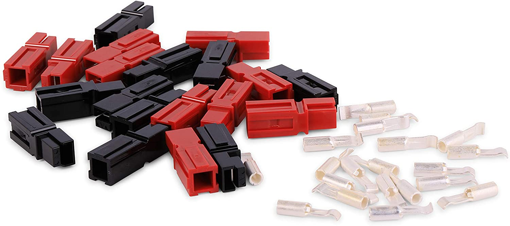
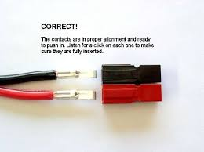
Ferrule Connectors
^^^^^^^^^^^^^^^^^^
* Different connector size for different gauges of wire
* Used to connect to ports such as PDP and VRM
* Definitely use on competition bots to prevent loose wires

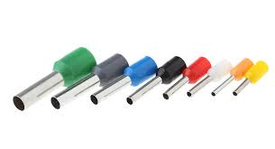
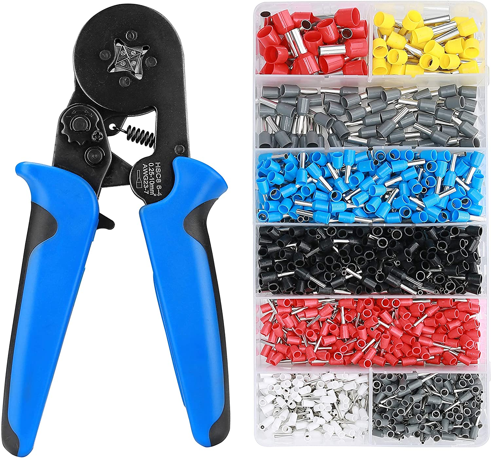
Power Wire (Black + Red)
^^^^^^^^^^^^^^^^^^^^^^^^
* These would be connected to both the 12 volt battery and the PDP.
* Red = positive
* Black = negative
* The wires will have an adaptor so it can connect to the battery.
.. note:: 
  The battery will need an adaptor as well which you need to learn how to do but most of the batteries we have already have them

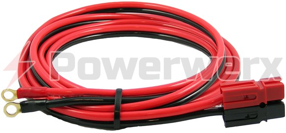
CAN Wire (Green + Yellow)
^^^^^^^^^^^^^^^^^^^^^^^^^
* We use CAN wire to create a CAN bus loop between the drivetrain motors and any additional motors on the robot
* CAN wire is also connected to the RoboRio, PDP, and PCM.

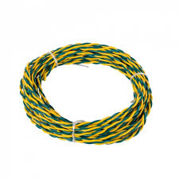
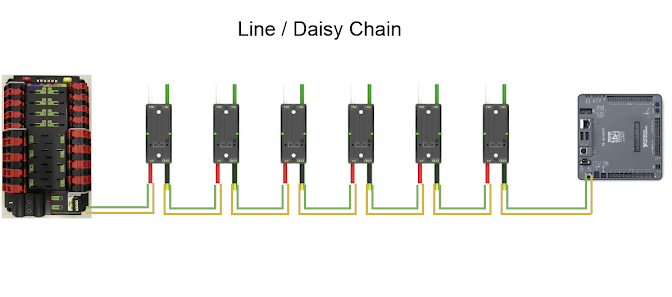
RoboRio 
^^^^^^^
* The RoboRio is the brain of the robot. It acts as the bridge between the code and body.
* Tells every part of the robot what to do.
* It needs a router though which is hooked up through the ethernet port.

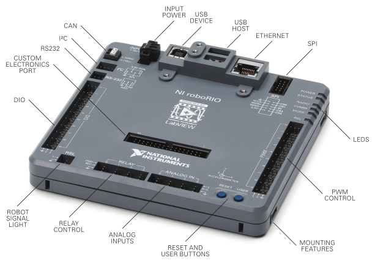
Motors
^^^^^^
* What is a Drivetrain 
  * A drivetrain is the system of motors, gears, and wheels that make up the robots drive system.
* DC Brush Motors
  * A brushed DC motor uses a configuration of wound wire coils, the armature, acting as a two-pole electromagnet.
* Brushless Motors
  * A brushless motor utilizes a permanent magnet as its external rotor.
.. note:: 
  Make sure to label the motors so it makes it easier for programmers and yourself to identify the trouble motor

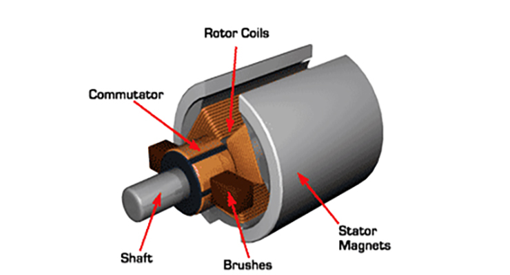
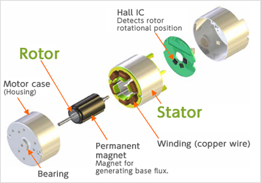
Motor Controllers
^^^^^^^^^^^^^^^^^
* Connects motor to rest of robot
* Delivers instructions to motors derived from RoboRio and other sources
* All controllers are connected by CAN wire
* CAN wire connects them to RoboRio
* Sole module connecting to motors
* Connect to PDP  

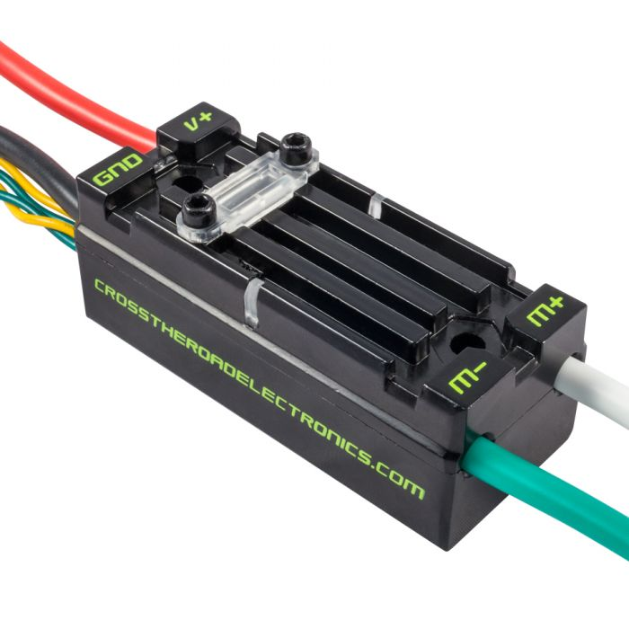
Limit Switch
^^^^^^^^^^^^
* Works as a mechanical brake for a system on the robot 
* Activated by an object pushing against the switch arm
* This ties into its two states: whether or not there is connectivity across the circuit
* Senses a single position of a moving part of the robot
* Prevents movement from exceeding a certain point
* Plugs into DIO

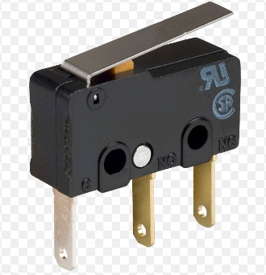
Batteries
^^^^^^^^^
* `Batteries <https://www.batteriesplus.com/product-details/sealed-lead-acid/battery/duracell-ultra/slaa12=18nb>`_ will need an adaptor in order for it to be able to charged/hooked up to the robot.
* We use 12 volt batteries.

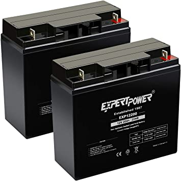
RSL Signal Light 
^^^^^^^^^^^^^^^^
* On every robot we have an RSL signal light
* SUPER IMPORTANT, it tells us and everyone around that the robot is on and activated
* Connects to the RoboRio next to RSL

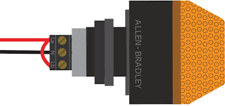
Power Distribution Panel (PDP)
^^^^^^^^^^^^^^^^^^^^^^^^^^^^^^
* This component distributes the power
* This is where the main battery plugs into
* All major components and motors plug into the PDP

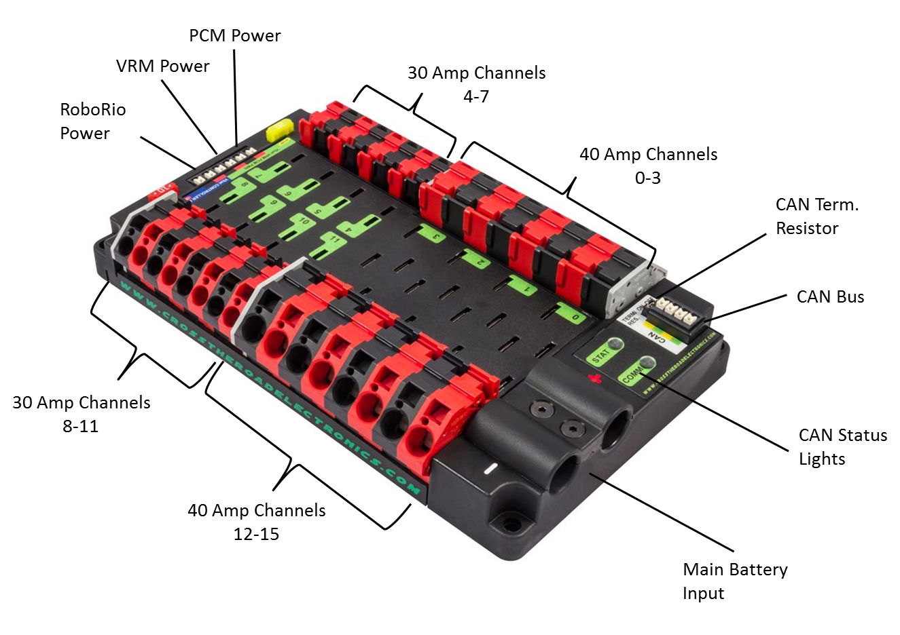
Fuses
^^^^^
* These little guys can often be forgotten (trust me), but the robot will not work without them
* The fuses plug into the PDP, and determines exactly how much power goes through that output
* There are 20, 30, and 40 amp fuses for all of the outputs, and 10 amp fuses for the power row of the PDP (as pictured)

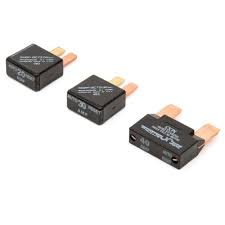
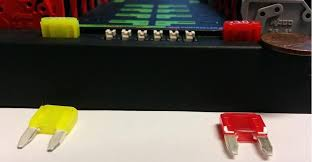
Voltage Regulator Module (VRM)
^^^^^^^^^^^^^^^^^^^^^^^^^^^^^^
* This component regulates the amount of voltage that goes through the wires
* *REMEMBER* different components use different amounts of voltage, too much can cause a component to short out
* This is also used for any additional things you add to the robot (like LED lights :))

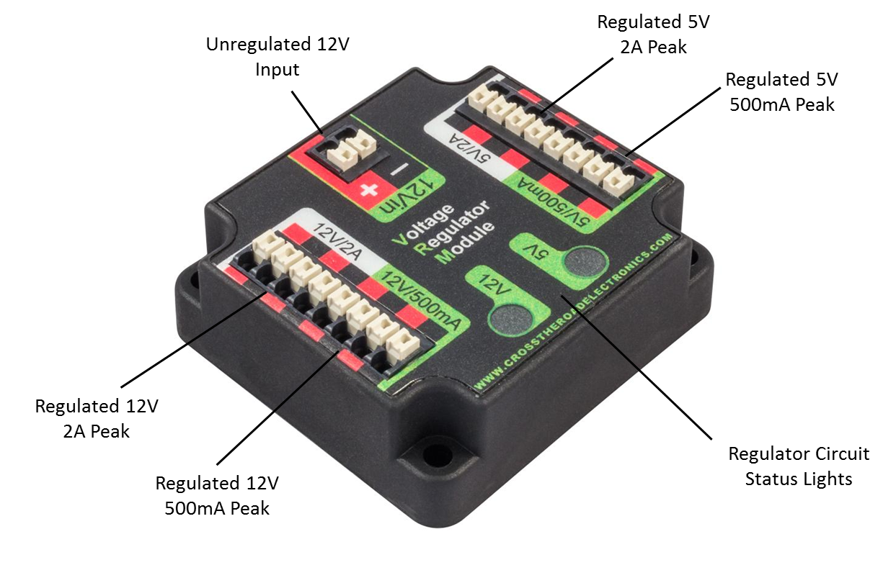
Circuit Breaker
^^^^^^^^^^^^^^^
* A safety device for the robot, if it draws too much power it will automatically shut off! 
* This is basically the on/off switch for the robot 
* It connects directly to the battery, under the bolt
* *REMEMBER* Place this in an accessible place on the robot 
* Circuit Breaker = On
  .. image:: images/EPComponents/oncb.png
* Circuit Breaker = Off
  .. image:: images/EPComponents/offcb.png 

Radio
^^^^^
* Gets hooked up to the RoboRio, pretty much the WiFi for the robot 
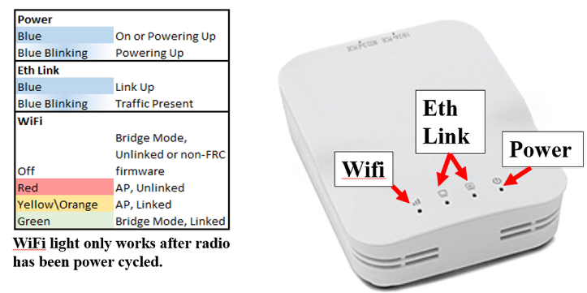
* Where the ethernet cable connects to the robot
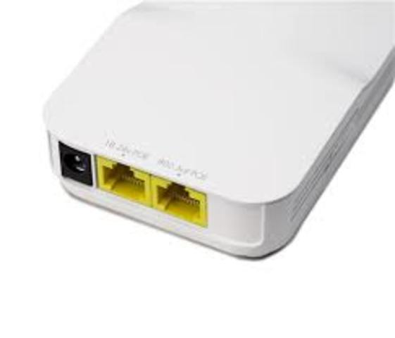
* This section of the documentation documents setting them up (Programming) (ADD THE LINK-- and do the same for rr)
  
Extra Stuff (LEDs, Circuits, etc.)
^^^^^^^^^^^^^^^^^^^^^^^^^^^^^^^^^^
* All extra circuits on your robot should connect to the VRM or the PDP
* If you need to draw over 12V use the PDP 
* Make sure you plug it in to the correct voltage and amperage so you don't end up (WHAT-- PROGRAMMER HAS NO CLUE WHAT THIS IS SUPPOSED TO SAY)
  
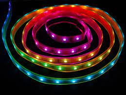

.. _pneumatics:
Pneumatics 
~~~~~~~~~~

Pneumatics Diagram
^^^^^^^^^^^^^^^^^^

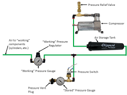

Pneumatics Control Module (PCM)
^^^^^^^^^^^^^^^^^^^^^^^^^^^^^^^
* It's a CAN-based device that provides complete control over the compressor and up to 8 solenoids per module.
* It connects the pneumatic system to the electrical system

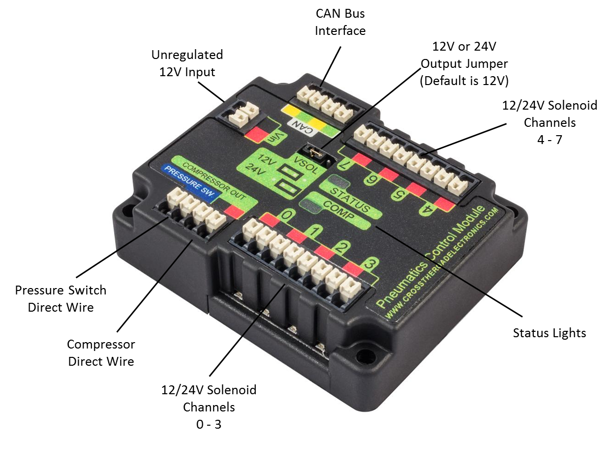
Pistons
^^^^^^^
* A disk or short cylinder fitting closely within a tube in which it moves up and down against a liquid or gas.

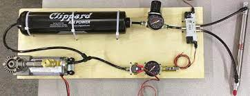
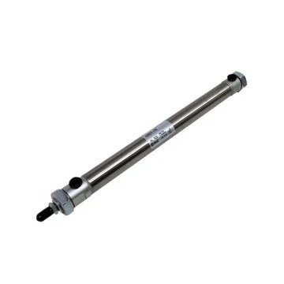
Solenoids
^^^^^^^^^
* A solenoid is a type of electromagnet. In a solenoid valve the magnetic field created by a solenoid is used to switch a valve that 
controls the flow of air in the pneumatic control system.

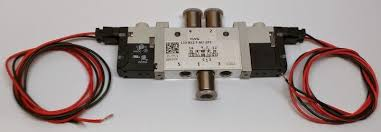
Tubing
^^^^^^
* The tubing inserts into the connectors (first picture)
* It's where the air actually flows through 
* Make sure you have a secure connection or it may leak

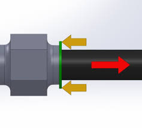
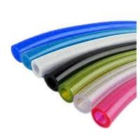
Compressor
^^^^^^^^^^
* Compresses the air for the rest of the pneumatics system
* Connects directly to the PCM to 'compressor out'

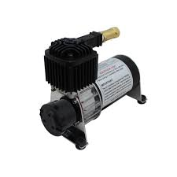
Air Tank
^^^^^^^^
* This stores the air used for the pneumatic system 
* Pneumatics tubing connects to each end.

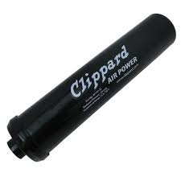
Pressure Gauge
^^^^^^^^^^^^^^
* Displays the current pressure in the pneumatic tubes
* Should never go past 160

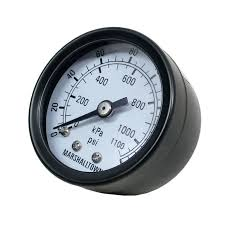
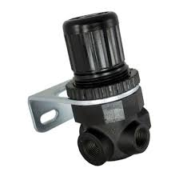
Pressure Switch
^^^^^^^^^^^^^^^
* Wires are attached to the two screws and plug into the PCM (pressure sw.)
* Connects to brass connector near the pressure gauge 

Pressure Relief Valve
^^^^^^^^^^^^^^^^^^^^^

Brass Connectors
^^^^^^^^^^^^^^^^

T Brass Connectors
^^^^^^^^^^^^^^^^^^

Schematics (Natalie's)
^^^^^^^^^^^^^^^^^^^^^^

Schematics (Raul's)
^^^^^^^^^^^^^^^^^^^

Inspector's Checklist
^^^^^^^^^^^^^^^^^^^^^

