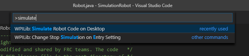
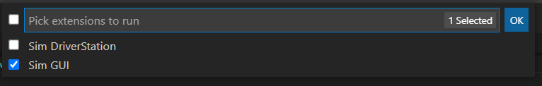

WPILib Simulator
================
Information of WPILib Simulator

* :ref:`definition`
* :ref:`using`
* :ref:`links`

.. _definition:

What is it?
~~~~~~~~~~~
WPILib Simulator is a simulation tool built directly into the FRC suite of tools. 
It allows the user to deploy a virtual robot using your machine rather than a physical roboRIO. 
While an effective tool, it is important to not heavily rely on, as it may not always be 100% accurate.
However, it is a good tool to use after a successful build, or remapping, to test functions and make sure that your robot doesn't quit.
Even if your robot builds successfully, it may not deploy- or may quit once enabled.

.. _using:

Using the Simulator
~~~~~~~~~~~~~~~~~~~
After successfully building, open the Command Palette with (Ctrl+Shift+P) and find "WPILib: Simulate Robot Code on Desktop"

After, make sure that both "Sim DriverStation", and " Sim GUI" are both enabled.
Driver Station will not be simulated if the box is not checked.

If done correctly, the Sim GUI should now be open. From here, you can test out joystick inputs, see if commands are running, and more.
Make sure that your virtual robot is enabled before testing, as the simulator may not be responsive otherwise. 

.. _links:

Useful Links
~~~~~~~~~~~~
* `link <https://docs.wpilib.org/en/stable/docs/software/wpilib-tools/robot-simulation/simulation-gui.html>`_
* `link <https://docs.wpilib.org/en/stable/docs/software/wpilib-tools/robot-simulation/introduction.html>`_